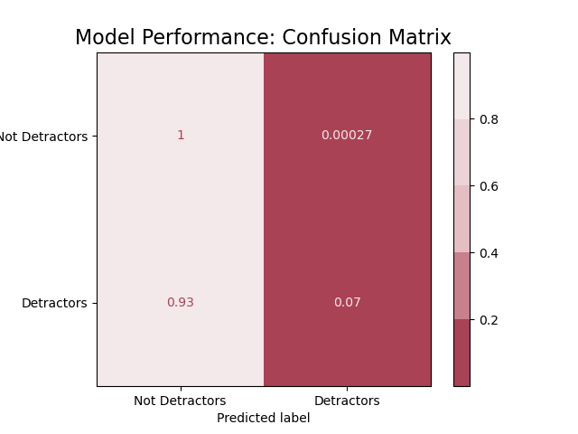
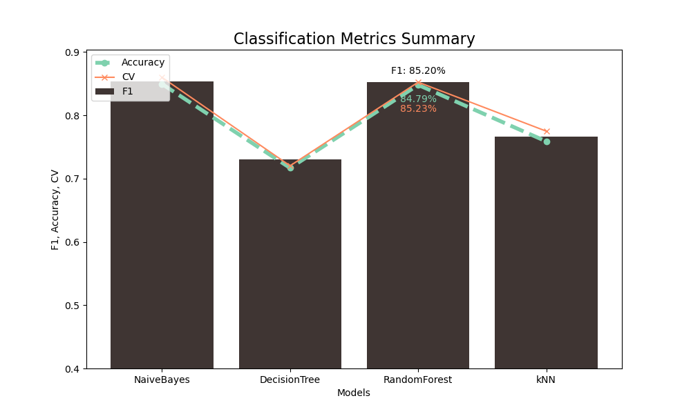
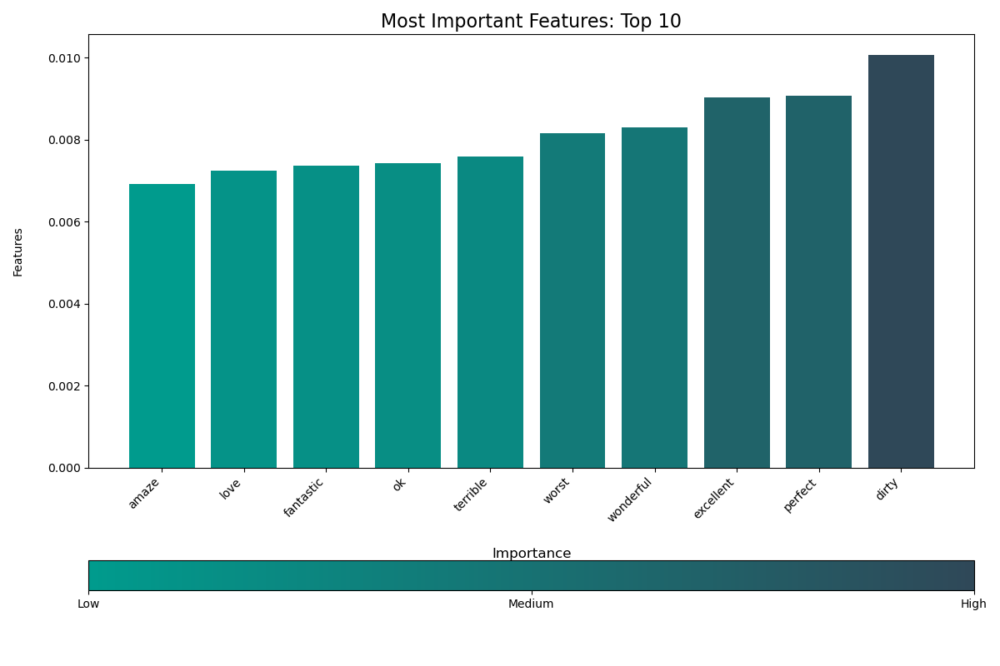

# Natural Language Processing: Tweet Sentiment Predictions

<p align="center">
  
</p>

### Table of Content
**1. [Overview](#overview)**<br>
**2. [Business Understanding](#business_understanding)**<br>
**3. [Data Understanding](#data_understanding)**<br>
**4. [Data Preparation](#data_preparation)**<br>
**5. [Modeling](#modeling)**<br>
**6. [Evaluation](#evaluation)**<br>
**7. [Findings & Recommendations](#findings_n_recommendations)**<br>
**8. [Limits & Next Steps](#limits_n_next_steps)**<br>


<a id='overview'></a>
## 1. Overview

This notebook examines tweets about Google and Apple products and predicts whether the sentiment of unseen tweets is positive or negative.
The organization of this notebook follows the CRoss Industry Standard Process for Data Mining (CRISP-DM) is a process model that serves as the base for a data science process.


<a id='business_understanding'></a>
## 2. Business Understanding

We, as the agency entrusted by Samsung, have been tasked with shaping the marketing strategy for the imminent <u>launch</u> of their cutting-edge <u>folding tablet</u>. 
<br>Due to the unique nature of the product, substantial funds were allocated for research and development. Consequently, there is a constraint on budget for the launch phase. 
<br>Nevertheless, Samsung aims to generate significant buzz around this groundbreaking product, confident that its innovation will speak for itself. 


In our initial conversations, it was recommened that the product be unveiled at South by Southwest, a major conference in the industry. The event has an `Interactive` division, which focuses on new technology where speakers, parties and trade shows are hosted. 

The objective of this project has two main aspects: 
1. Analyze the success stories of the two technology leaders in the industry at South by Southwest 
    * Identify factors that were received positively to understand dynamics of a successful launch - and not positive responses to know what to avoid
2. Predict the tweets' sentiment 
    * Every strategy needs to measure the Return On Investment. Predicting tweet sentiment will provide a quantifiable metric to evaluate the efficacy of the deployed strategy.
    
    
The target audience is Samsung marketing strategy teams. 

<a id='data_understanding'></a>
## 3. Data Understanding

* **Data Source**

The data comes from CrowdFlower via [data.world](https://data.world/crowdflower/brands-and-product-emotions). 

Tweets about the two leading technology brands and products were grouped into the dataset. The tweets were categorized by the sentiment that was expressed: positive, negative or neutral. The product or brand referenced by the short text is also indicated when known. 

The file `judge-1377884607_tweet_product_company.csv` can be downloaded at the provided link. 
It was then renamed to `tweet_product_company.csv`and saved into the current folder, within the 'data' subfolder, to be accessed into the raw DataFrame. 

* **Features**

Prior to preprocessing, the columns are: 

  * `tweet_text`: the actual tweet's record
  * `emotion_in_tweet_is_directed_at`: the product or company referred to in the tweet
  * `is_there_an_emotion_directed_at_a_brand_or_product`: the tweet's sentiment

* **Target**

The tweet's sentiment is the target for the dataset. The specific column is `is_there_an_emotion_directed_at_a_brand_or_product`. Based on a given set of tweets, we will try to predict if the tweet's emotion was positive, negative or neutral. 

<a id='data_preparation'></a>
## 4. Data Preparation

### 4. 1- Data Cleaning
In the first part of data preparation, the typical data cleaning tasks are addressed before splitting the set between train and test data. The steps include:

  a)Column names' change<br>
  The column names are particularly long. For an easier process to handle, they will be renamed in the new DataFrame called `df`:
* `tweet`
* `product_or_company`
* `sentiment`
  <br>b) Missing data was either dropped or replaced by 'undefined'
  <br>c) Duplicates were dropped
  <br>d) Sentiment classification was turned into a binary one
    <br>Due to the nature of the target, we will focus on the positive tweets. Hence all the other tweets, whether they are neutral or negative, will be considered ***not positive***. For easier reference, it will be identified as ***negative***.

<p align="center">
  
</p>
  <br>e) Train-Test Split was performed
  <br>The dataset is being divided into two separate subsets: a training set, and a testing (or validation) set. The validation set will allow to assess the performance of the model.
  The dataset is split before any further transformation is done to prevent data leakage. 

### 4. 2- Data Preprocessing & Exploratory Analysis

In order to preprocess the tweets, the following transformations were performed: 
* **Standardizing case**
    <br>This step is important to ensure text is uniform and consistent. This prevents models from treating words with different cases as different ones
    
* **Tokenizing**
    <br>Tokens of one or two consecutive words were created. This was done with the `RegexpTokenizer` package from nltk.tokenize <br>
* **Stopwords** 
    <br>To focus on the data's theme, English stopwords were removed. Manual additions were made in this text's context (i.e. "sxsw", "mention")  
* **Lemmatize** 
    <br> The `WordNetLemmatizer` package from nltk.stem.wordnet was used to reduce words to their base form, allowing a more accurate analysis
* **Frequency Distribution**
    <br>The `FreqDist` package was used to review in a dictionary-like output, the words and their frequencies
* **WordCloud**
    <br> The words' frequencies were represented visually thanks to the `WordCloud` package
* **Bigrams**
    <br> Bigrams were drawn to have a better understanding of the themes, i.e. pop was identified with pop-up store, thanks to the `collocations` package and its BigramAssocMeasures
* **Mutual Information Scores**
    <br> Bigrams that occur more than 5 times were examined through `mutual information scores`

The preprocessing tasks were summarized as a function which was called both on the train and test data, defining the following columns:
- `tweet_original`: keeping the original copy of tweets, unchanged
- `tweet`: the preprocessed version of the tweets, including the above tasks
- `tokenized_tweet` the preprocessed version of the tweets, not combined as list for each row


<p align="center">
  
</p>


<a id='modeling'></a>
## 5. Modeling

We now have an initial idea for recommendations for the marketing strategy. Our objective is now to:
1. Provide more precise recommendations
2. Develop a tool to measure the tweets' sentiments, once the strategy is deployed

Because it is important to measure both sentiments: whether they are positive, or negative, the evaluation metrics we will focus on will be accuracy and F1. 
<br>In addition, the dataset is highly imbalanced: 67% of tweets are not positive. This is natural to have more reviews around negative than positives and we expect new unseen data to have similar distributions.  
<br>Accuracy score by itself might be misleading, while F1 considers both false positives and false negatives. 

As the dataset is a text, it requires a transformation before it can be used for modeling. Like other types of dataset would one-hot encoded, here, the tweets were vectorized, using the common method in natural language processing: `TfidfVectorizer`.  
<br> It converts a collection of text documents to a matrix of tf-idf features. 

* `Term-Frequency` (TF)
<br>Measures how often a term (word) appears in a document

* `Inverse Document Frequency` (IDF)
<br>Measures the importance of a term in the entire collection of documents. 


4 main classification models were explored: 
1. Multinomial Naive Bayes
2. Decision Tree
3. Random Forest 
4. K-Nearest Neighbor 

The models' parameters were tuned using the following approaches:
1. Under Sampling
2. Hyperparameter Tuning
    * Combinatoric Grid Searching


All models went through 4 steps:
    1) Fitting and training on train data
    2) Evaluation Metrics 
    3) Classification Report
    4) Confusion Matrix


### 5. a) Baseline Model with TfidfVectorizer and MultinomialNB

### <u>1st iteration</u>: Tfidf Vectorizer with Pipeline 
The evaluation metrics recorded for the 1st iteration were as follows:

- Accuracy: 0.6724
- F1-Score: 0.5407
- Precision: 0.4521
- Mean Cross-Validated Accuracy: 0.6726

### <u>2nd iteration</u>: Addressing class imbalance: undersampling negative tweets
The model does not have enough data for positive tweets, comparatively to negative ones. 

As a consequence, the dataset needs to be resampled. More precisely, negative tweets need to be undersampled.

Original class distribution:
- negative    4575
- positive    2227


Class distribution after undersampling:
- negative    2227
- positive    2227


Results for this model were:
- Accuracy: 0.5692
- F1-Score: 0.5806
- Precision: 0.6030
- Mean Cross-Validated Accuracy: 0.5706

The accuracy score drastically decreased, but we now have a precision and f1 scores, indicating the 'positive sentiments' are now correctly represented.


### <u>3rd iteration</u>: including stopwords
We will now test fitting the vectorizer by removing the stopwords from tweets to review if this can help predictions be more accurate.

- Accuracy: 0.5992
- F1-Score: 0.6067
- Precision: 0.6183
- Mean Cross-Validated Accuracy: 0.6036

The accuracy score now increased slightly, however it remains below just guessing the majority class.

### <u>4th iteration</u>: Applying the full preprocessing to tweets

- Accuracy: 0.5767
- F1-Score: 0.5887
- Precision: 0.6160
- Mean Cross-Validated Accuracy: 0.5888

All scores decreased, when applying the model on the full tokenized tweets.

### <u>5th iteration</u>: Tuning Tfidf Vectorizer - Hyperparameter tuning

The model performed better when stopwords were removed but worse when applied on the full tokenized tweets. Let's try to use combinatoric grid searching to find the best parameters for the vectorizer. 

- Accuracy: 0.6631
- F1-Score: 0.6711
- Precision: 0.6886
- Mean Cross-Validated Accuracy: 0.6491

The classification metrics are starting to increase and are starting to show more stability, less disparity among one another.


<p align="center">
  
</p>

### 5. b) TfidfVectorizer and Decision Trees
### <u>6th iteration</u>: Decision Trees Tfidf Vectorizer

Decision trees work well for understanding language because they are easy to interpret and handle the nuances in how words relate. They are good at understanding what words matter most and can deal with different types of word data without much difficulty. 


For higher computing performance, the best parameters recorded on the vectorizer with Multinomial Naive Bayes will be kept. Only the classifier will be modified. Let's see if, by using the best TF-IDF parameters with another classifier, we can improve further these predictions.

- Accuracy: 0.6750
- F1-Score: 0.6721
- Precision: 0.6697
- Mean Cross-Validated Accuracy: 0.6632

All scores slightly increased and remain consistent. Whether it is accuracy, F1, precision or the cross-validated accuracy, they are all in the 0.66 range as opposed to the previously recorded results. Cross-validated accuracy was in the 0.64 range, while precision was over 0.68.

<p align="center">
  
</p>


### 5. c) TfidfVectorizer and Random Forest
### <u>7th iteration</u>: RandomForestClassifierTuning Tfidf Vectorizer

Random Forest classifiers can be thought of as an extension of multiple decision trees working together together to understand language text.Let's see if, by using the best TFIDF parameters with another classifier, we can improve further these predictions.


- Accuracy: 0.6918
- F1-Score: 0.6796
- Precision: 0.6760
- Mean Cross-Validated Accuracy: 0.6861

The overall scores increased, recording the highest F1 Score reached. The model still has difficulty identifying positive tweets due to the dataset imbalance.

<p align="center">
  
</p>


### 5. d) TfidfVectorizer and K-Nearest Neighbor
### <u>8th iteration</u>: TfidfVectorizer and K-Nearest Neighbor

The previous model was a bit computationally expensive. Let's see if the simpler K-Nearest Neighbor classifier would improve on that end. Nevertheless, kNN makes predictions based on what similar cases around it suggest so there is a risk it captures more noise created by the imbalanced dataset, despite the undersampled negative tweets.

- Accuracy: 0.6839
- F1-Score: 0.5890
- Precision: 0.6703
- Mean Cross-Validated Accuracy: 0.6813


The F1 score highly decreased compared to the Random Forest model. Indeed, the model correctly predicted 98% of negative tweets as negative - which makes sense: kNN looks at similar cases to make predictions.

However the actual positive tweets predicted decreased to 8%. This model cannot be kept at the best one.

<p align="center">
  
</p>


<a id='evaluation'></a>
## 6. Evaluation
### 6. a) Final Model and Classification Metrics

The model that predicts the most accurately the non functional wells is the **Random Forest** where Hyperparameters were tuned thanks to Combinatorics GridSearching. The best parameters found for this model were the following:


All key classification metrics from the best models were stored into 3 variables so the four final models were compared.  

### 6. b) Model Performance

<u>Evaluation Metrics</u>

* Evaluation Metrics on Train Data
  - Accuracy: 0.6918
  - F1-Score: 0.6796
  - Precision: 0.6760
  - Mean Cross-Validated Accuracy: 0.6861


* Evaluation Metrics on Unseen Data
 -  Accuracy: 0.6918
 -  F1-Score: 0.6796
 -  Precision: 0.6760
 -  Mean Cross-Validated Accuracy: 0.6631

The model is slightly overfitting, which suggests that the model may be capturing noise in the training data that doesn't generalize well to unseen data. This might be due to undersampling of negative tweets. 


<p align="center">
  
</p>


The classification report and confusion matrix summarize the evaluation of the model's performance on predicting sentiment for tweets related to technology brands (here, Google and Apple) during the SXSW conference. 

The model performs better on predicting *negative* sentiment tweets compared to *positive* sentiment tweets, and this is reflected in all scores. 
F1 is the highest recorded among all models. This score is particularly useful in this dataset, as it is imbalanced, and because it considers both false positives and false negatives. 
The overall weighted accuracy for this model is slightly below 70%. 


Looking at the details by metric: 

<u>F1-Score</u>:

`F1-score` is the harmonic mean of precision and recall. It was defined as the main metric for this project, as the cost of false negative and false positive was similar, in the sense that both positive and negative tweets need to be accurately predicted. 

The average weighted score recorded for F1 for the random forest model was the highest recorded, despite a larger disparity between F1 score for positive tweets and for negative tweets are more accurately predicted than positive tweets, which provides better scores for negative tweets than positive on all fronts, F1 being one of them. 

<u>Precision</u>:

`Precision` measures the accuracy of the positive predictions made by the model. Precision focuses on minimizing false positives. A high precision indicates that when the model predicts a positive class, it is likely to be correct. This balances a lower recall for positive tweets, since about 54% of positive tweets predicted as positive, are likely to be correctly identified as such. 

<u>Recall</u>:

`Recall` measures the ability of the model to capture all the positive instances in the dataset (true positives). Once again, negative tweets are more accurately predicted than positive ones. This can be seen on the confusion matrix on the top left corner. 83% of negative tweets are correctly predicted, while less than 41% of positive tweets are correctly predicted. 

<u>Accuracy</u>:

Finally, `accuracy` measures the overall correctness of the model predictions. Close to 70% of all tweets were correctly identified.


<p align="center">
  
</p>


<a id='findings_n_recommendations'></a>
## 7. Findings & Recommendations 

### 7. a) Most Important Features
The most important features for the model help us gather the main themes and make the recommendations previously identified, more precise.



### 7. b) Recommendations

To generate buzz around the launch of Samsung's new folding tablet, consider implementing the following key strategies:

1. In-Person Sales and Pop-Up Stores:

    * Offer exclusive early access to SXSW attendees, creating a sense of urgency and desire.
    * Establish pop-up stores within the conference venue to further engage and captivate potential buyers.
    * Foster anticipation by orchestrating lines, enhancing the overall attraction and exclusivity.
    * Innovative Conference App:

2. Develop a cutting-edge mobile app for both phones and tablets, enhancing conference access and engagement.
    * Leverage the app to tap into attendees' creativity, creating a platform for discussion and interaction.

3. Strategic Hashtag Campaign:
    * Take inspiration from the excitement around social network launches, such as Google Circles, by creating a dedicated hashtag.
    * Recognize the evolving landscape of social networks and harness the hashtag to generate excitement and participation.
    * Position the hashtag as a means to win the new tablet, fostering eagerness among the audience.

4. Exclusive Party Integration:

    * Utilize the app to create exclusivity, making it a prerequisite for access to an exclusive party.
    (Blend the party experience with the hashtag campaign, encouraging attendees to use the hashtag for a chance to access the tablet release concert).
    * Strive to surpass the success of the previous year's concert, ensuring the party becomes a highlight of the event.


These refined strategies aim to capture the essence of successful past events, combining physical presence, technological innovation, social media engagement, and exclusive experiences to maximize the impact of the tablet launch at the SXSW conference.


<a id='limits_n_next_steps'></a>
## 8. Limits & Next Steps

Despite providing us a good idea for recommendations, the accuracy and F1 score remain low, we would aim at reaching above 70%. 

To do this in the future we would:
* Synthetically Oversample the Minority class
<br> In addition to undersampling tweets to a certain level, positive tweets should be synthetically oversampled as well to try to draw better results. 

* Stratified Undersampling:
<br> Stratified undersampling may protect from the importance given to single words, by keeping the ratio of words or token

* Hyperparameters Tuning
<br> We searched best parameters for the vectorizer only, but not for the classifier. By changing these, the accuracy, could be improved 


## For More Information 
See the full analysis and code in the [Jupyter Notebook](notebook.pdf) as well as summary in this [presentation](presentation.pdf).


For additional info, contact [Albane Colmenares](mailto:albane.colmenares@gmail.com?subject=[GitHub]%20Source%20Han%20Sans)

## Repository Structure
```
├── data
├── images
├── .gitignore
├── README.md
├── natural-language-processing.ipynb
├── presentation.pdf
└── notebook.pdf

```
"# tripadvisor_sentiment" 
