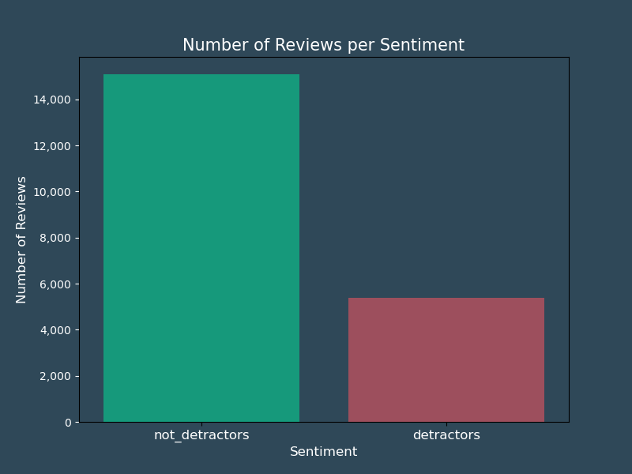

<!-- <div style="display: flex;text-align: left; ">
     <h1>Predicting TripAdvisor Review Sentiment</h1> 
     <div style="margin-right: 5px; margin-left: -29px">
        
    </div> 
    <h1>Predicting TripAdvisor Review Sentiment</h1> 
</div> -->


<div style="margin-right: 5px; margin-left: -29px; display: flex; text-align: left; white-space: nowrap;">
  <h1 style="white-space: nowrap;">Predicting TripAdvisor Review Sentiment</h1>
  
</div>

### Table of Content
**1. [Overview](#overview)**<br>
**2. [Business Understanding](#business_understanding)**<br>
**3. [Data Understanding](#data_understanding)**<br>
**4. [Data Preparation](#data_preparation)**<br>
**5. [Modeling](#modeling)**<br>
**6. [Evaluation](#evaluation)**<br>
**7. [Findings & Recommendations](#findings_n_recommendations)**<br>
**8. [Limits & Next Steps](#limits_n_next_steps)**<br>


<a id='overview'></a>
## 1. Overview

This notebook examines reviews about hotels from guests who stayed there and predicts whether the sentiment of reviews is positive or negative.
The organization of this notebook follows the CRoss Industry Standard Process for Data Mining (CRISP-DM) is a process model that serves as the base for a data science process.

<a id='business_understanding'></a>
## 2. Business Understanding

The increasing significance of online reputation and social media in the hospitality industry has become integral to a hotel's operational and financial success. The [report](https://ecornell-impact.cornell.edu/the-impact-of-social-media-on-lodging-performance/) from Cornell's Center for Hospitality Research highlights the rising trend of consumers relying on online reviews during hotel bookings. The study reveals the link between a hotel's online reputation and its pricing, occupancy rates and revenue performance. 

Recognizing the challenges faced by hotels in managing online reputation, a **new branch of TripAdvisor** is now dedicated to supporting and advising hotels on how to **improve their online reputation**. The branch launched a new B2B product identifying **unsatisfied guests in real time** with the goal to improve their experience before they leave. 
<br>Our first client is a worldwide hotel chain: Hyatt. The intended users are corporate directors of guest experience.  

Through real-time guest reviews and a sophisticated algorithm, the platform alerts general managers about guests requiring immediate attention. The goal is to enable proactive measures to enhance satisfaction. This innovative tool, backed by an analysis of over 20,000 real guest reviews, also offers tailored recommendations for improvement upon implementation, aligning with the goal of turning [detractors](https://www.datasciencecentral.com/what-is-a-good-net-promoter-score-for-the-hotel-resort-industry/) into promoters. 


**The Task**: Deploying Hyatt's strategy to increase their online reputation
<br>

**Objectives**

1. Short-term: improve guest experience 
    * thanks to our customized recommendations targeting areas that historically caused guest complaints 
<br>

2. Long-term: reduce the share of negative reviews  
    * by identifying unsatisfied guests through real-time reviews, aiming at improving their experience before they leave

**Target Audience:** Hyatt's corporate director of guest experience

<a id='data_understanding'></a>
## 3. Data Understanding

* **Data Source**

The data is hosted on [Kaggle](https://www.kaggle.com/datasets/andrewmvd/trip-advisor-hotel-reviews) and is provided by *LARXEL*. 

In order to access the file, access the data source through the link provided and click on the `download` button at the top right corner. This will download a zipped folder. The below code unzips it upon loading the data. 

The dataset contains about twenty thousand reviews collected from a hotel's TripAdvisor page. Each review is assigned a rating from 1 to 5, 1 being the lowest (negative review), 5 being the highest (positive review).


* **Features**

Prior to preprocessing, the columns are: 

* `Review`: the actual review's record
* `Rating`: a number from 1 to 5, given by the guest at the time of the review

* **Target**

The target will be identifying negative reviews. It will be created based on the `Rating` column, and will be named `Sentiment`. Based on a given set of reviews, I will predict if the review's sentiment was negative. To be more precise, it will be identified as `detractors`. This term is defined by the metric measuring online reputation: Net Promoter Score. 

More on NPS below.

<a id='data_preparation'></a>
## 4. Data Preparation

### 4. 1- Data Cleaning
In the first part of data preparation, the typical data cleaning tasks are addressed before splitting the set between train and test data. The steps include:

* Missing data
  <br>Missing values were inspected but none were found, no modification was necessary. 
* Duplicates
  <br>Duplicates were researched but none were found: no modification was necessary.
* Binary classification
  <br>Ratings range from 1 to 5, 1 being the lowest and 5 the highest.
  <br>A new column `Sentiment` was created to group customers' reviews as follows: 
    *  Reviews' rating ranging from 1 to 3 included: `detractors`
    * All other reviews: `not_detractors`

The reason for such a classification follows the definition of NPS score.

**NPS Score**

<p align="center">
  
</p>


The Net Promoter Score ([NPS](https://textexpander.com/blog/how-to-calculate-nps)) is a metric used to measure customer satisfaction and loyalty with a hotel, (or more generally a product, service, or company). It is based on the question: "How likely is it that you would recommend our *hotel*? 
The responses can be measured on a scale from 0 to 10 or in our case: 1 to 5. 


<p align="center">
  
</p>

* Train-Test split
<br>The dataset is being divided into two separate subsets: a training set, and a testing (or validation) set. The validation set will allow to assess the performance of the model.
The dataset is split before any further transformation is done to prevent data leakage. 

Two parameters were assigned:
- `random_state=42` for reproducibility
-  `stratify=y` to address class imbalance issues


* Encoding target
In order to make predictions useable in calculations, I encoded the target: 
  - 0 replaced `not_detractors`
  - 1 replaced `detractors`

### 4. 2- Data Preprocessing & Exploratory Analysis

In order to preprocess the reviews, the following transformations were performed: 
* **Standardizing case**
    <br>This step was verified as it is important to ensure text is uniform and consistent. Nevertheless, no extra step was taken as text was already saved as lower case.

* **Character Encoding**
    <br> This was done to ensure consistent representation of text by transforming non-text characters into a normalized format, which will facilitate proper text processing, analysis, and model training.
    
* **Tokenizing**
    <br>Tokens of words were created. This was done with the `RegexpTokenizer` package from nltk.tokenize. This step will facilitate the conversion of word into a suitable form for analysis and modeling.  <br>
* **Stopwords** 
    <br>To focus on the data's theme, English stopwords were removed. Manual additions were made in this text's context, such as adding industry specific word (i.e. "hotel", "stay")  
* **Lemmatize** 
    <br> The `WordNetLemmatizer` package from nltk.stem.wordnet was used to reduce words to their base form, allowing a more accurate analysis
* **Frequency Distribution**
    <br>The `FreqDist` package was used to review in a dictionary-like output, the words and their frequencies


* **WordCloud**
    <br> The words' frequencies were represented visually thanks to the `WordCloud` package
  <p align="center">
    
  </p>


* **Bigrams**
    <br> Bigrams were drawn to have a better understanding of the themes thanks to the `collocations` package and its BigramAssocMeasures


* **Mutual Information Scores**
    <br> Bigrams that occur more than 5 times were examined through `mutual information scores`

    

The preprocessing tasks were summarized as a function which was called both on the train and test data. 


<a id='modeling'></a>
## 5. Modeling

I now have an initial idea for recommendations on focus areas to improve guest satistfaction. 
<br>My objective is now to:
* Develop a tool to identify unsatisfied customer reviews in real time

Incorrectly identifying a guest as satisfied when they weren't would lead in a detractor posting a review instead of catching them while they are in-house, and having a chance of improving their satisfaction. 

As a consequence, `recall` is the main evaluation metric for this model.


As the dataset is a text, it requires a transformation before it can be used for modeling. Like other types of dataset would one-hot encoded, here, the reviews were vectorized, using the common method in natural language processing: `TfidfVectorizer`.  
<br> It converts a collection of text documents to a matrix of tf-idf features. 

* Term-Frequency
<br>Measures how often a term (word) appears in a document
* Inverse Document Frequency (IDF)
<br>Measures the importance of a term in the entire collection of documents. 

7 main classification models were explored: 
1. Multinomial Naive Bayes
2. K-Nearest Neighbor 
3. Decision Tree
3. Random Forest 
4. Gradient Boosting
5. AdaBoost
6. XGBoost

Undersampling, stopwords, lemmatize, and hyperparameter tuning were parameters used to tune models. In addition, X_train was split with `stratify` in order to keep the distribution ratios for ech sentiment.  


All models went through 4 steps:
    1) Fitting and training on train data
    2) Evaluation Metrics 
    3) Classification Report
    4) Confusion Matrix
    5) ROC-AUCs


The 7 models' results and their evaluation metrics are summarized below. The highest records are highlighted.

  <p align="center">
    
  </p>  

  The most relevant ones can be summarized through the below bar chart.
  <p align="center">
    
  </p>  
  

<a id='evaluation'></a>
## 6. Evaluation
### 6. a) Final Model and Classification Metrics

The model that predicts the most accurately the detractors reviews is the **Naive Bayes Tuned with Grid Search**.


<u>Evaluation Metrics</u>

* Evaluation Metrics on Train Data
  - Accuracy: 0.8274
  - Recall Detractors: 0.8615
  - Train data: Mean Cross-Validated Accuracy: 0.8370

 -  Test data: Mean Cross-Validated Accuracy: 0.8454

### 6. b) Model Performance


<p align="center">
  
</p>

<p align="center">
  
</p>
The classification report, confusion matrix and ROC-AUC summarize the evaluation of the model's performance on predicting detractors from hotel TripAdvisor reviews. 

The model performs better on predicting *detractors* sentiment. More precisely, it has a true positive rate higher for this class than for the *not_detractors*. 

This score was the focus for the evaluation of the models, as the cost of false negative is higher than the cost of false positive. If a review from a detractor was incorrectly identified as "not detractor", the hotel would miss an opportunity to transform a guest's negative experience.  


Looking at the details by metric: 


**Accuracy**
<br>The mode correctly identified close to 83% of all reviews. 

**Recall**
<br>86.15% of actual detractors were correctly predicted.

**F1 Score**
<br>The balance between precision and recall. It is lower (72.5%) for the detractors class, which indicates precision is lower for this class. 

**AUC**
<br>The Area Under the Receiver Operating Characteristic Curve (AUC) value of 0.9145 indicates a high effectiveness in distinguishing between the two classes: `not_detractors` and `detractors`. 
The ROC curve, which plots the true positive rate against the false positive rate, covers a significant area under the curve.


<a id='findings_n_recommendations'></a>
## 7. Findings & Recommendations 

### 7. Recommendations 


The advantage of our new service is the deployment can be immediate. Based on historical guest complaints, below are the areas we recommend to focus on to immediately start improving guest satisfactions. 

1. Focus on resort hotels
<br>→ These hotels have the most unsatisfied guests
2. Develop a maintenance program with engineering teams
<br>→ Appearance & dysfunctionality cause frustrations
3. Train staff to enhance friendliness
<br>→ Also ensure more languages are spoken
4. Respond to reviews
<br>→ Detractors advise to read reviews 


<p align="center">
  
</p>  


These areas of focus are based on the most common bigrams from detractors. 


<a id='limits_n_next_steps'></a>
## 8. Next Steps & Limits

* **Deployment**
<br>Once the immediates areas of focus are implemented, the next step is only to:

- display the QR code at strategic locations for guests to access TripAdvisor to give real time feedback
- only provide us with 2 contacts details. These persons will receive the alerts when guests provide negative feedback 
- communicate about this new tool to your teams 


Very quickly, you will see the share of negative reviews decrease in your hotels, and your NPS score increase!  

<br>Extract the reviews specifically for your hotel chains, to ensure the model is based on your specific reviews. We, at TripAdvisor can do this for you for a supplement.  

<br>

* **Limits** 
<br>The model provided very high scores for recommendations. If basing the model on your own hotel chains' reviews is not an option, ensure the most recent data for reviews is taken into account. 

<br>

* **Next Steps**
<br> Deploy the model for a ternary classification, following the actual sentiments defined by NPS score: `promoters`, `neutral`, `detractors`.

## For More Information 
See the full analysis and code in the [Jupyter Notebook](pdfs/notebook.pdf) as well as summary in this [presentation](pdfs/presentation.pdf).


For additional info, contact [Albane Colmenares](mailto:albane.colmenares@gmail.com?subject=[GitHub]%20Source%20Han%20Sans)

## Repository Structure
```
├── data
├── images
├── pdfs
├── .gitignore
├── cap_environment.yml
├── README.md
├── tripadvisor_reviews_detractors.ipynb

```
